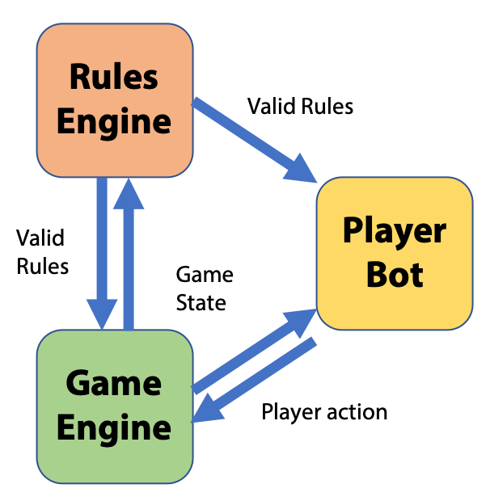

# CamelAI
A data-driven approach to decision-making in the context of camel race betting

## Introduction
This project aims to understand the decision-making process in a competitive market with limited resources. The proxy for this scenario is the game [Camel Up](https://en.wikipedia.org/wiki/Camel_Up) by Pegasus Spiele. The core mechanics of the game involve placing bets on camels on a race track. The game is divided into 'rounds', in which each of the camels are moved in a random order. Players can choose one of four actions each turn:

- move a random camel along the track,
- place traps to impede or help camels that land on them,
- make a bet on which camel will be furthest along at the end of the current round, or
- make a bet on which camel will win the entire game.

The game's difficult stems from the fact that camels can stack on top of each other if they land on the same space. If a camel is moved, all camels on top of it in the stack are also moved. This adds a layer of complexity to the game that makes it nearly impossible for a human player to fully understand the joint probability of any action being "good" in the sense that it optimizes the player's probability of winning.

This project consists of several elements that will be used to analyze the game mechanics and the joint probabilities of any given action increasing the win-rate of a player.

## Simulating the game
The basis of this project is a digital version of Camel Up that allows the simulation of a game. This digital game consists of three elements:
1. Game engine: keeps track of player actions and the current game state,
2. Rules engine: determines which actions are permissible and which are forbidden based on the current game state,
3. Player bots: decide, on the basis of the current game state, which actions to execute.



Upon a player's turn, the player bot receives the current game state as well as a list of all valid action. On this basis, it chooses an action to perform and communicates this to the game engine. The game engine ensures that this action is valid and then updates the game state accordingly.

The easiest way to simulate a game is by running the following shell command from the command line:

```bash
python rungame.py <NUM_GAMES> <PLAYER_1> ... <PLAYER_N>
```

where NUM_GAMES is an integer indicating how many games should be simulated. PLAYER_1, ..., PLAYER_N are the names of the player bots to set as players. These should be the names of classes in the `bots.py` file. See below for more information on the bots.

The command `python rungame.py 100 RandomBot RandomBot RandomBot RandomBot` would therefore simulate 100 games between four identical players (`RandomBot`) whose strategy is to select a random action.

The game logs are stored as CSV files in the directory `game_logs`. See below for more information on the logs

## Player Bots

## Game Logs
